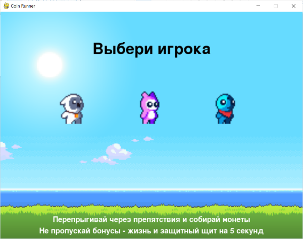
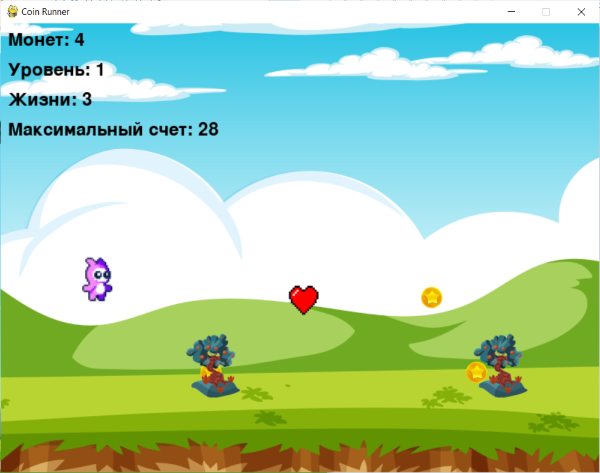
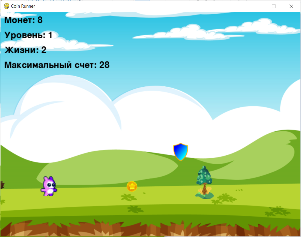
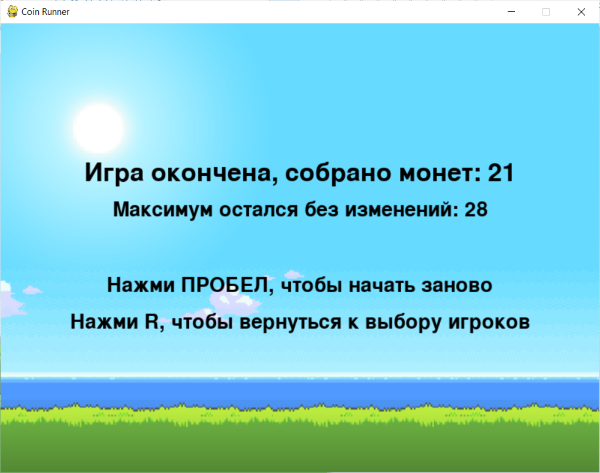

# Игра Coin Runner 

## Описание игры

**Coin Runner** —  это 2D игра, в которой игрок управляет персонажем, собирает монеты, избегает препятствий и использует бонусы для улучшения своих возможностей.
 
Цель игры — набрать как можно больше очков, избегая столкновений с препятствиями.

## Особенности игры

Управление персонажем: прыжки, сбор монет.

Разные уровни сложности.

Бонусы: дополнительные жизни и защитный щит.

Анимация персонажа и эффекты (взрывы при переходе на новый уровень).

Система сохранения максимального счета.

## Установка

Убедитесь, что у вас установлен Python версии 3.7 или выше.

Скачайте или клонируйте репозиторий с игрой.

Установите необходимые зависимости:

**pip install -r requirements.txt**

Запустите игру:

**python main.py**

## Управление

- **Пробел** или **Вверх**: Прыжок.

- **P**: Пауза.

- **R**: Возврат к выбору игрока

## Структура проекта

**main.py** — основной файл игры.

**data/** — папка с ресурсами (изображения, звуки).

***fon.png, fon1.png, fon2.png, fon3.png, fon4.png*** — фоны уровней.

***game1.png, game2.png, game3.png*** — спрайты игроков.

***coin.png, explosion.png, bonus_life.png, bonus_shield.png*** — изображения объектов.

***background_music.mp3, jump.wav, coin.wav, collision.wav, level_up.wav*** — звуковые эффекты.

***rock.png, stone.png, tree.png...*** - изображения препятствий.

***results.txt*** - сохранение максимального счета для игроков.

**requirements.txt** — файл с зависимостями.

## Как играть

Запустите игру.

Выберите персонажа.

Собирайте монеты, избегайте препятствий и используйте бонусы.

Старайтесь продержаться как можно дольше и набрать максимальное количество очков.

## Скриншоты 

### Стартовое окно

### Игровой экран

### Финальный экран

